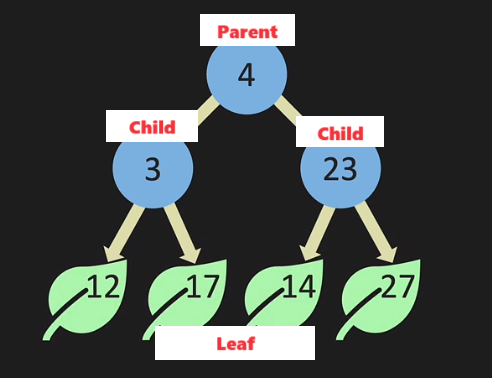
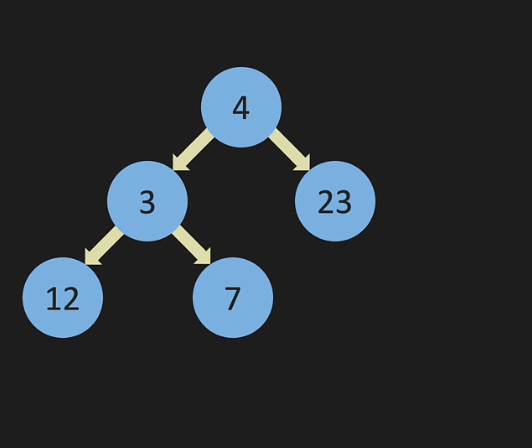
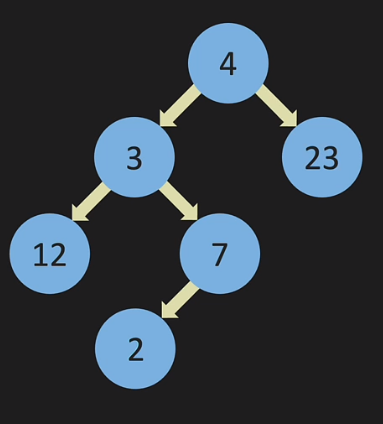
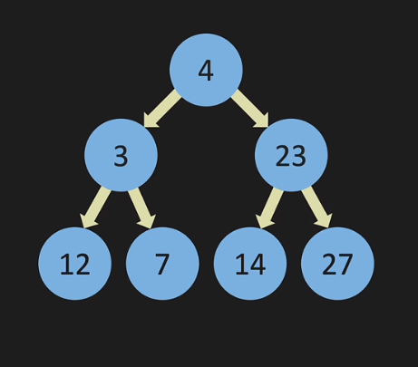
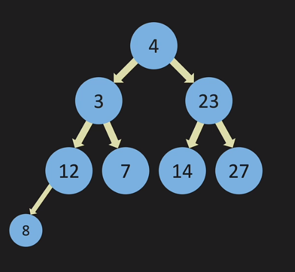
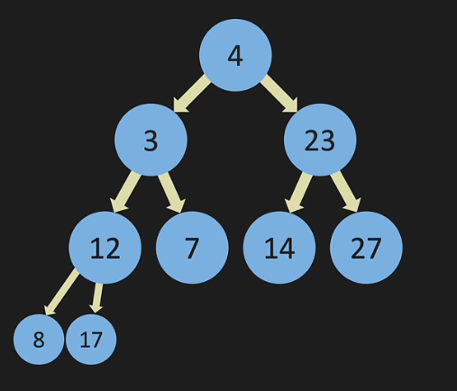
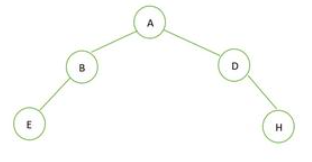
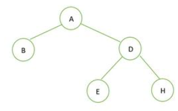
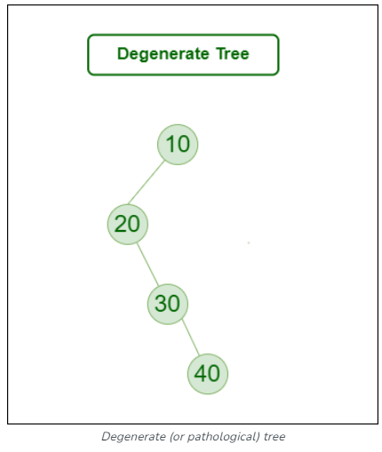
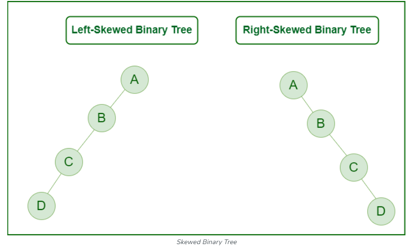

# Tree

참고 : https://www.geeksforgeeks.org/types-of-binary-tree/?ref=lbp

트리는 LinkedList 의 구조와 유사하다. LinkedList 는 가지 뻗기를 하지 않은 트리 구조라고 볼 수 있다.

# Binary Tree

이진 트리의 기본 구조.

## 트리의 종류

## 대표적인 세가지 종류

### Full Tree(정 이진 트리)

모든 노드가 노드 두 개를 가리키거나 아예 가리키지 않는 형태.

- 모든 레벨에서 노드가 가득 찬 트리.
- 단말 노드를 제외한 모든 노드가 자식 노드를 가지며, 각 노드의 자식 노드 수는 0 또는 2 여야한다.

Full ✅

Full ❌

### Perfect Tree(포화 이진 트리)

모든 내부 노드가 두 개의 자식 노드를 가진 풀 트리이다.

- 모든 단말 노드가 같은 레벨에 있어야 한다.
- 모든 레벨이 가득 차 있고, 마지막 레벨을 제외한 다른 모든 레벨에서 노드가 가득 찬 상태.

Perfect ✅ , Full ✅

Perfect ❌ , Full ✅

### Complete Tree (완전 이진 트리)

왼쪽에서 오른쪽으로 순서대로 노드가 채워진 트리.

- 마지막 레벨을 제외한 모든 레벨이 가득 차 있어야 한다.
- 마지막 레벨은 왼쪽부터 순차적으로 노드가 채워져야 한다.

Complete ✅, Full ❌, Perfect ❌

Complete ❌, Full ❌, Perfect ❌

Complete ✅ , Full ✅, Perfect ❌

Complete ❌, Full ✅, Perfect ❌

### 다른 형태도 있다!

- Degenerate Tree   모든 내부 노드가 하나의 하위 노드를 갖는 트리.
  
- Skewed **Binary** Tree
  

# Binary Search Tree (BST)

이진 탐색 트리 = 이진트리 + 규칙

### 이진 탐색 트리의 규칙.

특정 노드의 왼쪽 하위 노드는 기준 노드보다 작은 값을 가진다. 오른쪽 노드는 기준 노드보다 큰 값을 가진다.

⇒ 기준 노드보다 작으면 왼쪽 하위에 위치. 크면 오른쪽 하위에 위치.

중복된 키를 허용하지 않는다.

## BST Big O

### BST vs ArrayList vs LinkedList

|  | BST | LinkedList  | ArrayList  |
| --- | --- | --- | --- |
| insert | O(log n) 으로 취급하나 따지고 보면 사실 O(n) |  O(1) | O(n) - 인덱스 정렬이 필요한 경우. 
O(1) - 마지막 인덱스로 단순 삽입. |
| lookup | O(log n) |  O(n) | O(n) - 값으로 조회.
O(1) - 인덱스로 조회. |
| remove | O(log n) | O(n) - 중간 노드 제거.
O(1) - 처음 혹은 끝 노드 제거. | O(n) - 인덱스 정렬이 필요한 경우.
O(1) - 마지막 인덱스 제거. |

### Insert

어떤 규칙을 가진 BST이던 기본적으로 체크해야 할 것.

- root 가 비었는가?
- 삽입 될 요소가 존재하는 것과 중복인가?